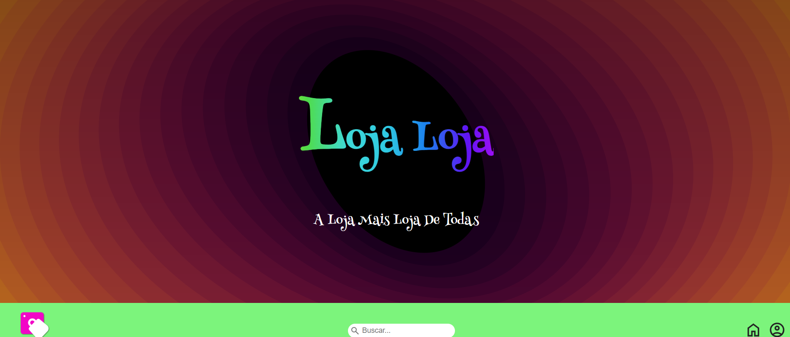
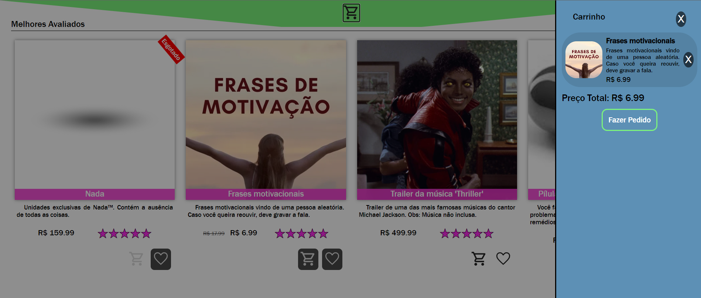

# Loja Loja

Esta é a documentação da loja virtual _Loja Loja: A Loja mais Loja de Todas_. Aqui falará sobre o site, tendo a descrição, os requisitos, local de hospedagem, anotações de desenvolvimento e como usar o git para desenvolver o site.

## Sumário

1. [Descrição](#descrição)
1. [Lista de Tarefas](#lista-de-tarefas)
1. [Desenvolvimento](#desenvolvimento)
    1. [Configurar no Git](#configurar-no-git)
    1. [Clonando o Repositório na Máquina](#clonando-o-repositório-na-máquina)
    1. [Fazendo Alterações no Projeto](#fazendo-alterações-no-projeto)
1. [Requisitos](#requisitos)
    * [Requisitos Funcionais](#requisitos-funcionais)
    * [Requisitos Não Funcionais](#requisitos-não-funcionais)
1. [Objetivos](#objetivos)
1. [Linguagens Utilizadas](#linguagens-utilizadas)
1. [Design](#design)
1. [Ideias de Produtos](#ideias-de-produtos)
1. [Explicação do Código](#explicação-do-código)
    1. [HTML](#html)
    1. [CSS](#css)
    1. [JavaScript](#javascript)
    1. [db.json](#dbjson)
    1. [README.md](#readmemd)
    1. [Licença](#license)
    1. [Prettier](#prettierrc)
    1. [Assets](#assets)
1. [Formatação e Convenções](#formatação-e-convenções)
1. [Imagens](#imagens)

## Descrição

_Loja Loja: A Loja mais Loja de Todas_ é uma loja virtual em que é possível visualizar e fazer a compra de diversos produtos e serviços, como um aperto de mão aleatório, o conceito de plano cartesiano, a cor rosa choque e unidades únicas de nada.

## Lista de Tarefas

- [x] Documentação
    - [x] Tutorial de como usar o git para desenvolver
    - [x] Requisitos
    - [x] Objetivos, descrição, linguagens utilizadas
    - [x] Ideias de produtos
    - [x] Formatação e convenções
    - [x] Documentação final (imagens, etc)
- [x] Design
    - [x] Escolha de paleta de cores
    - [x] Escolha de fontes
    - [x] Design UI/UX
- [x] Implementação
    - [x] Base HTML
    - [x] Estilização base CSS
    - [x] Código JavaScript
    - [x] JSON informações produtos
- [x] Testes

## Desenvolvimento

Você precisa ter uma conta no github e ter sido colocado como colaborador do projeto.

### Configurar no Git

Caso não esteja configurado no Git, você deve colocar no git bash os comandos:

```
git config --global user.name "Nome de Usuário"
git config --global user.email "emailgithub@gmail.com"
```

### Clonando o repositório na máquina

É necessário fazer uma clonagem do repositório na sua máquina. Para isso, você deve colocar no git bash os comandos:

```
git clone https://github.com/bruno08nunes/loja-loja.git
cd loja-loja
```

### Fazendo alterações no projeto

Antes de começar a trabalhar, é sempre recomendado puxar as alterações feitas para a sua máquina, usando o comando:

```
git pull origin main
```

Também é recomendado criar uma nova branch para fazer as alterações. Você deve fazer usando:

```
git checkout -b dev
```

É recomendado que as alterações sejam feitas por etapas, de pouco a pouco. Você deve fazer um commit com as alterações feitas, colocando no git bash:

```
git add .
git commit -m "Mensagem descrevendo as alterações"
```

Depois é necessário apenas enviar para o repositório remoto. Caso você já esteja conectado entre o git e o github, você deve executar o primeiro código, se não, o segundo.

1.
```
git push -u origin main
```
2.
```
git push origin main
```

Caso haja mais dúvidas, veja: [Git e Github - Tutorial](https://docs.google.com/document/d/1UeFRh8nkwYq1HemMNNc_1RpyQb_FGNWZEEgKtZuF8Ko/edit)

## Requisitos

Esta seção mostra as funcionalidades que o site precisa ter.

### Requisitos Funcionais

* [rf1] - Página inicial com produtos à venda
* [rf2] - Header com nome do site, barra de pesquisa, link para conta do usuário e botão para vizualizar o carrinho
* [rf3] - Sidebar com produtos do carrinho que pode ser aberta e fechada. Os itens do carrinho são adicionados no Local Storage, permanecendo após fechar a página
* [rf4] - Produtos terem:
    * Nome
    * Descrição
    * ID
    * Categorias
    * Preço
    * Unidades em estoque
    * URL de imagens
    * Nota do produto
* [rf5] - Pesquisa de produtos, aparecendo algum que tenha nome ou descrição condizente com o pesquisado
* [rf6] - Exibição de itens na página principal, divido por categorias, mostrando:
    * Nome do produto
    * Parte da descrição
    * Algumas categorias
    * Preço
    * Botão para adicionar/remover da lista de desejo
    * Botão para adicionar/remover do carrinho
    * Imagem
* [rf7] - Footer com formulário de cadastro, informações de contato, e informações de copyright
* [rf8] - Página de compra de cada item, exibindo todas as informações do produto, botão de compra, botão para adicionar/remover da lista de desejo, botão para adicionar/remover do carrinho e nota, com você podendo avaliar também.
* [rf9] - Página de formulário de compra de item, colocando endereço e informações de compra
* [rf10] - Página de cadastro no site, com nome completo, email e senha. Essas informações ficam salvas no Local Storage.
* [rf11] - Página de perfil, que você pode colocar uma foto (fica salva no IndexedDB), ver lista de desejo, carrinho e algumas de suas informações.
* [rf12] - Gerar PDF com informações de compra

### Requisitos Não Funcionais

* [rnf1] - Responsividade. Funcionar independente do sistema operacional, tamanho de tela ou navegador.
* [rnf2] - Pouco requisito de processamento
* [rnf3] - Pouco requisito de espaço
* [rnf4] - Pouco requisito de internet. Carregamento rápido
* [rnf5] - Ambiente seguro para o usuário
* [rnf6] - Interface fácil de manipular
* [rnf7] - Interface acessível
* [rnf8] - Disponibilidade alta
* [rnf9] - Código limpo e reutilizável

## Objetivos

O objetivo do projeto é criar uma loja virtual não funcional. Porém deve ter página de compra e carrinho. Serve para conseguirmos aprender sobre mais sobre HTML, CSS e JS, principalmente sobre Local Storage.

## Linguagens Utilizadas

* HTML
* CSS
* JavaScript

## Design

* Cores:
    * Rosa - #f205c7;
    * Rosa Claro - #fc2aec;
    * Verde - #7cf47c;
    * Azul - #5d90b5;
* Fontes:
    * Henny Penny
    * Quite Magical
    * Franklin Gothic Medium

## Ideias de Produtos

* Aperto de mão de aleatório
* Unhas de anões
* Unidades de nada
* Frases motivacionais
* Plano cartesiano
* Teorema de Pitágoras
* "Indo Ali" esmagado
* Careca só a careca (pessoa não inclusa)
* Rosa choque
* Salada de chupeta
* Graus celsius
* Um nerd (emoji)
* Garantia de compra (impressão não inclusa)
* ~Chuva (para usar seu mais novo guarda chuva Guarda chuva acoplado com uma formiga)~
* Entupidor de nariz
* Núcleo da terra
* Trailer da música "Thriller" do Michael Jackson (música não inclusa)
* Bruno Emo<sup>TM</sup>
* Orelha em conserva
* Sor Árlan (fora de estoque)
* Susto em uma caixa de sapato
* Pílula de dilema
* Pílula de aula de filosofia e sociologia do sor Árlan.
* Sopro
* Micro-onda (onda, não aparelho)
* Ansiedade
* Letra do alfabeto árabe

## Explicação do Código

### HTML

Há cinco páginas html, cada uma com uma funcionalidade. Elas estão dentro da pasta pages. Elas são:
* Index - página principal, que mostra os produtos que podem ser comprados. Não está na pasta pages;
* Form-account - página de login, acessada através do header;
* Account - página da conta, acessada através do header após logar;
* Product - página que mostra um produto de forma individual, com todas as informações e comentários; 
* Form-product - página de formulário para compra de itens. Acessível através do carrinho, caso haja produtos.

Todas as páginas possuem o mesmo cabeçalho, mesmo footer e mesmo carrinho, mudando apenas o main de cada parte e o hero na página principal

### CSS

O código css da página principal está no style.css, contendo também as partes de footer e header. As demais estão em arquivos dentro da pasta style, que contém o mesmo nome do css. Eles ainda seguem o style.css como base, sendo importados nessa folha de estilo.

Também há os arquivos cart.css para o carrinho e o media-query.css para responsividade de todo o site. Ambos são importados no style.css.

### JavaScript

O código é separado em diversos módulos, que apararecem na pasta módulos. Há um para a inicialização de cada página, que pode alterar a página com base em dados vindo do local storage ou de um json.

São separados também em criarProduto, que é usado na página principal e na conta e atualizarCarrinho que é usado em todas as páginas.

No arquivo principal (script.js) é feita uma requisição para um json com os dados do produto e funcionalidades para o header e footer.

### db.json

Arquivo com as informações de cada produto

### README.md

Documentação do projeto

### LICENSE

Licença de copyright do site

### .prettierrc

Arquivo com estilização padrão do site, usado em conjunto com a extensão presente no Visual Studio Code e outras IDEs: Prettier.

### assets

Pasta que contém as imagens, vídeos e fontes usadas. Separada em
* fonts - Fontes
* examples - Prints do site para documentação 
* products - imagem dos produtos
* icons - ícones como carrinho, coração, conta, entre outros
* background.svg - Fundo do hero do index
* favicon.png - Imagem favicon do site
* logo.png - Logo que aparece no header

## Formatação e Convenções

Por padrão, os códigos do projeto devem seguir:

* Geral:
    * Quatro (4) espaços para indentação do código. Para facilitar isso, você deve instalar a extensão Prettier.
* HTML:
    * Uso de HTML semântico, evitando o uso de `<div>` e `<span>` e priorizando o uso de `<section>`, `<article>`, entre outros
* CSS:
    * Uso de _Flebox_ e _Grid Layout_ sempre que possível
    * Uso de classes para estilização em CSS. Podem ser usados outros seletores também, mas evitando o uso de tags e IDs
    * Nome de classes coerente, com palavras separadas por - (como: `header-principal`)
    * Declarações organizadas em grupos: (como: Posicionamento, Box model, Tipografia e Visual)
* JavaScript:
    * Nome de variáveis em português, sem acento
    * Nome de variáveis coerentes, com palavras separadas por _camelCase_ (como: `carrinhoDeProdutos`)
    * Variáveis declaradas apenas com `let` e `const`

## Imagens



